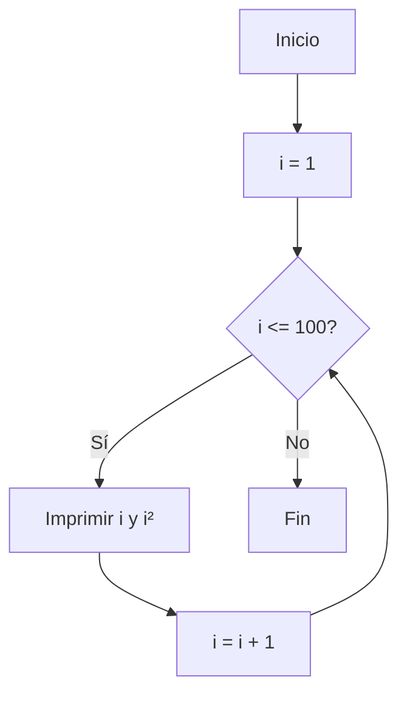
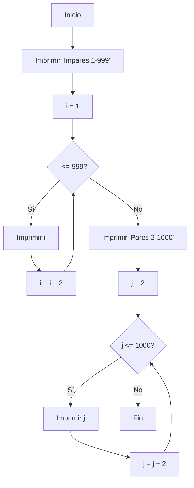
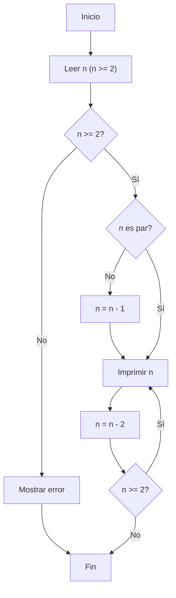

# Reto 6 - Ejercicios de Python

## Contenido
- **Ejercicio 1**: Imprime los números del 1 al 100 junto con sus cuadrados.
- **Ejercicio 2**: Imprime los números impares del 1 al 999 y los pares del 2 al 1000.
- **Ejercicio 3**: Imprime números pares descendentes hasta 2, o muestra error si n < 2.
- **Ejercicio 4**: Calcula el factorial de un número "n" dado.
- **Ejercicio 5**: Muestra los divisores de un número de 2 a 50.
- **Ejercicio 6**: Lista los números primos del 1 al 100.

## Diagramas de flujo

## Diagrama 1: Números con sus cuadrados

## Diagrama 2: Números impares y pares

## Diagrama 3: Números pares descendentes

